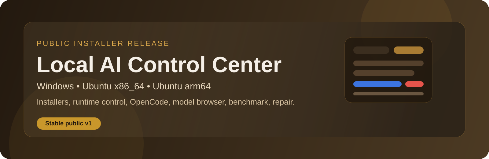
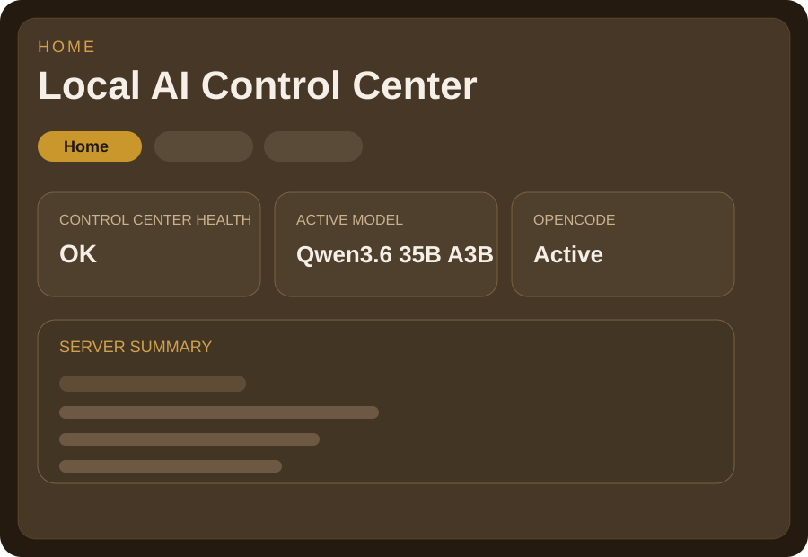
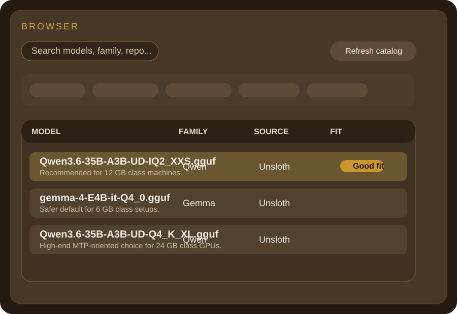
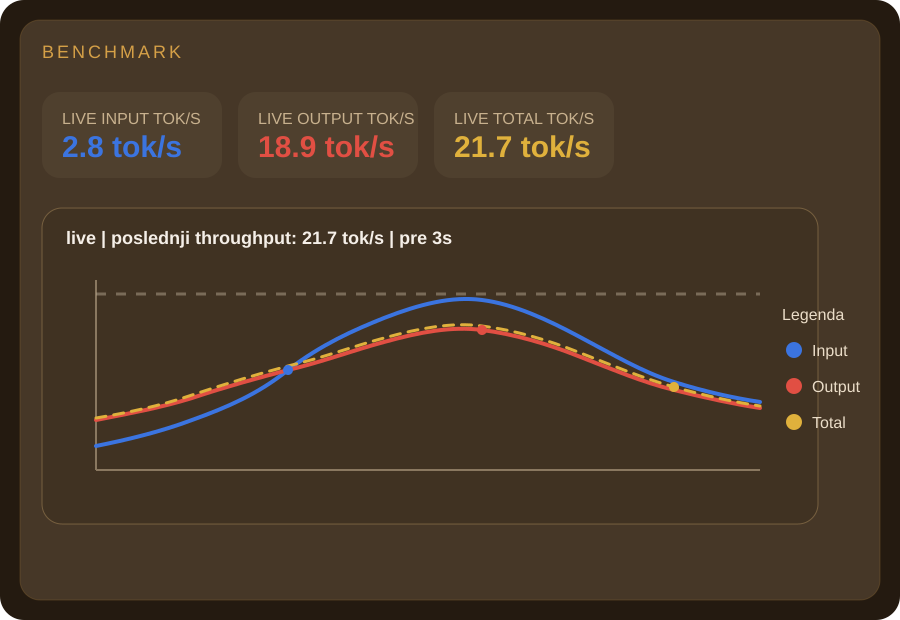

# Local AI Control Center

  

  <strong>Local-first AI control center for llama.cpp, OpenCode, model downloads, benchmarking, repair, and guided installers.</strong>
   
  <strong>Lokalni AI control centar za llama.cpp, OpenCode, preuzimanje modela, benchmark, repair i vođene instalere.</strong>

  
  
  
  

## Download latest installers

| Platform | Direct download |
| --- | --- |
| Windows | [Local-AI-Control-Center-Setup-2.24.8.exe](https://github.com/joes021/local-ai-control-center/releases/download/v2.24.8/Local-AI-Control-Center-Setup-2.24.8.exe) |
| Ubuntu x86_64 | [Local-AI-Control-Center-Setup-linux-x86_64-2.24.8.run](https://github.com/joes021/local-ai-control-center/releases/download/v2.24.8/Local-AI-Control-Center-Setup-linux-x86_64-2.24.8.run) |
| Ubuntu arm64 | [Local-AI-Control-Center-Setup-linux-arm64-2.24.8.run](https://github.com/joes021/local-ai-control-center/releases/download/v2.24.8/Local-AI-Control-Center-Setup-linux-arm64-2.24.8.run) |

Additional release files:
- [Latest release page](https://github.com/joes021/local-ai-control-center/releases/tag/v2.24.8)
- [checksums.txt](https://github.com/joes021/local-ai-control-center/releases/download/v2.24.8/checksums.txt)
- [support-matrix.json](https://github.com/joes021/local-ai-control-center/releases/download/v2.24.8/support-matrix.json)

## Product overview

### English

Local AI Control Center is a desktop-oriented, local-first control layer for running and managing local AI stacks. It combines installers, runtime control, model browsing, compatibility checks, OpenCode integration, benchmarking, and repair flows into one interface designed for real machines instead of demos.

What it gives you:
- Guided installers for Windows, Ubuntu x86_64, and Ubuntu arm64
- `Classic Full` and `Unified Full` installation flows
- Local model management with curated recommendations
- Browser-based GGUF catalog and compatibility calculator
- OpenCode integration with step presets and local model routing
- Runtime status, repair tools, and benchmarking

### Srpski

Local AI Control Center je lokalni desktop control layer za pokretanje i upravljanje lokalnim AI okruženjem. Spaja instalere, runtime kontrolu, browsing modela, compatibility proveru, OpenCode integraciju, benchmark i repair tokove u jedan interfejs pravljen za stvarne mašine, a ne samo za demo prikaz.

Šta dobijaš:
- vođene instalere za Windows, Ubuntu x86_64 i Ubuntu arm64
- `Classic Full` i `Unified Full` install tok
- lokalno upravljanje modelima sa preporučenim izborima
- browser za GGUF katalog i compatibility kalkulator
- OpenCode integraciju sa presetima i lokalnim model routingom
- runtime status, repair alate i benchmark

## Screenshot gallery

<table>
  <tr>
    <td width="33%">
      
    </td>
    <td width="33%">
      
    </td>
    <td width="33%">
      
    </td>
  </tr>
  <tr>
    <td align="center"><strong>Home</strong> Runtime, OpenCode, health, and machine summary.</td>
    <td align="center"><strong>Browser</strong> Model catalog, filtering, and download flow.</td>
    <td align="center"><strong>Benchmark</strong> Live tokens, charting, and test battery UX.</td>
  </tr>
</table>

## Quick start

### English

1. Download the installer for your platform from the latest release.
2. Run the installer and choose one of the recommended models during setup.
3. Wait for the first-run readiness check to finish.
4. Open Local AI Control Center and start using the local stack.

### Srpski

1. Skini installer za svoju platformu sa latest release strane.
2. Pokreni installer i izaberi jedan od preporučenih modela tokom setup-a.
3. Sačekaj da first-run readiness provera završi.
4. Otvori Local AI Control Center i koristi lokalni AI stack.

## Editions

| Edition | What it means |
| --- | --- |
| `Classic Full` | Legacy/full-stack install flow with the established runtime assumptions. |
| `Unified Full` | Full install flow plus the full `Next` control center shell and web UI layer. |

## Platform notes

| Platform | Status | Notes |
| --- | --- | --- |
| Windows | Public v1 | Full installer flow with guided model bootstrap and first-run probe. |
| Ubuntu x86_64 | Public v1 | Full installer flow with runtime health verification. |
| Ubuntu arm64 | Public v1 | Full installer flow without TurboQuant. `TurboQuant` is intentionally unsupported here. |

## Documentation

- [Getting started](./docs/GETTING_STARTED.md)
- [Troubleshooting](./docs/TROUBLESHOOTING.md)
- [Security policy](./SECURITY.md)
- [Release notes](./release-notes.txt)

## Repository map

| Path | Purpose |
| --- | --- |
| `backend/` | FastAPI backend, platform services, compatibility logic, runtime status |
| `frontend/` | React/Vite UI |
| `install/` | Installer logic for Windows and Linux |
| `launchers/` | Runtime launchers |
| `packaging/` | Release/build packaging scripts |
| `docs/` | Specs, plans, guides, and support documentation |
| `tests/` | Packaging, backend, and frontend smoke coverage |

## Public release position

This repository is now maintained as a public installer-first release line. The current goal is not just to build the UI, but to ship a real local AI product that non-technical users can install with a guided flow.

Ovaj repo se sada vodi kao javna installer-first release linija. Cilj nije samo da UI radi, nego da isporuči stvaran lokalni AI proizvod koji i netehnički korisnik može da instalira kroz vođeni tok.

